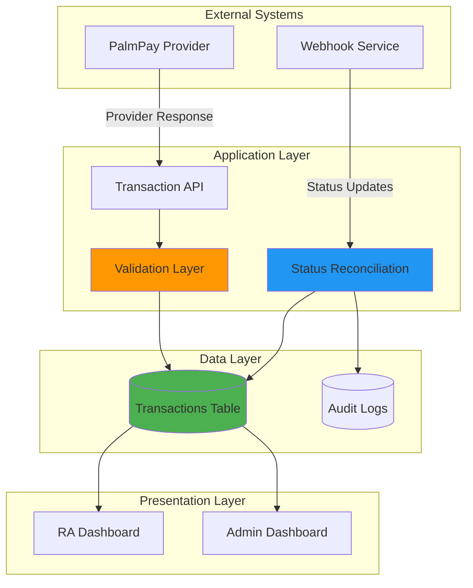
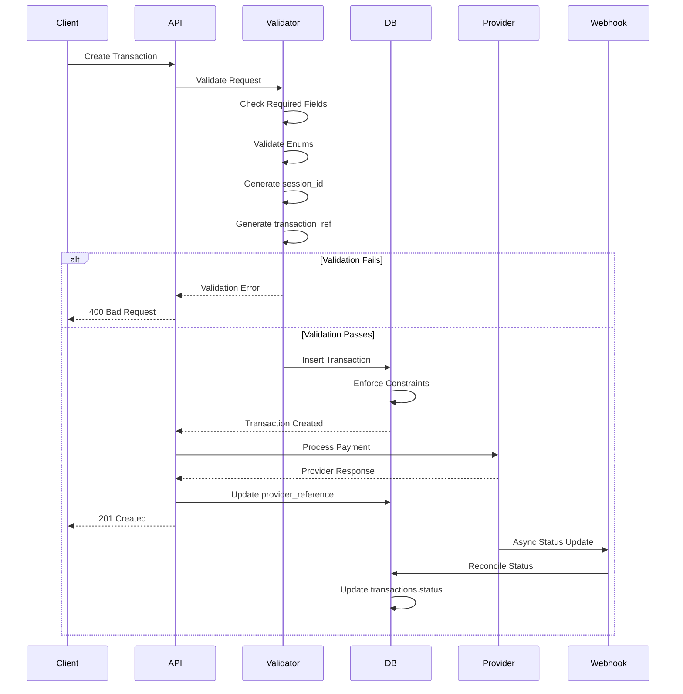
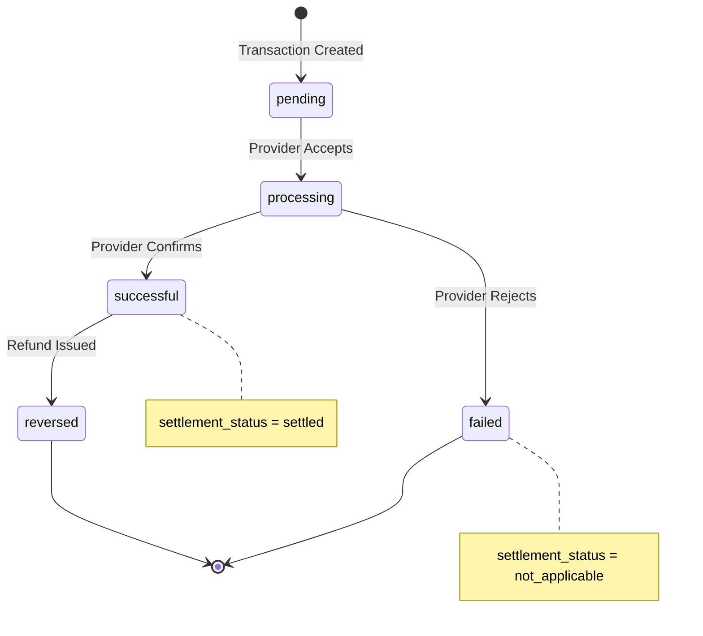

# Transaction Normalization - Design Document

## Overview

This design establishes a bank-grade transaction management architecture that eliminates data inconsistencies, status mismatches, and N/A field displays across the financial system. The solution implements a single source of truth for transaction data with strict schema constraints, canonical status management, and proper separation between customer-facing and internal accounting transactions.

### Core Design Principles

1. **Single Source of Truth**: The `transactions` table is the canonical source for all transaction data and status information
2. **Fail-Fast Validation**: Application-level validation prevents invalid data from reaching the database
3. **Type Safety**: Database ENUMs enforce valid values for transaction_type, status, and settlement_status
4. **Zero Nulls Policy**: NOT NULL constraints on critical fields eliminate N/A displays
5. **Audit Trail**: Complete transaction history with timestamps and change logging
6. **Performance First**: Strategic indexing for sub-second query performance at scale

### Problem Statement

The current system suffers from:
- Status conflicts between admin and company views due to multiple data sources
- N/A displays caused by nullable required fields (session_id, transaction_ref)
- Internal ledger entries appearing in customer-facing dashboards
- Missing provider references preventing reconciliation
- Inconsistent transaction type classification
- Poor query performance on large transaction volumes

### Solution Approach

The design implements:
- Normalized schema with NOT NULL constraints on critical fields
- Seven-type transaction classification system with ENUM enforcement
- Canonical status source in transactions.status with five-state model
- View-specific filtering (customer-facing vs. internal accounting)
- Automated status reconciliation with provider webhooks
- Comprehensive validation layer preventing invalid transactions
- Strategic indexing for high-performance queries

## Architecture

### System Context



### Transaction Flow Architecture



### Data Flow Layers

1. **Validation Layer**: Pre-database validation ensuring all constraints are met
2. **Persistence Layer**: Database with enforced constraints and indexes
3. **Reconciliation Layer**: Automated status synchronization with providers
4. **Presentation Layer**: View-specific filtering and formatting

## Components and Interfaces

### 1. Database Schema

#### Normalized Transactions Table

```sql
CREATE TABLE transactions (
    -- Primary Key
    id BIGINT UNSIGNED AUTO_INCREMENT PRIMARY KEY,
    
    -- Required Identifiers (NOT NULL)
    transaction_ref VARCHAR(255) NOT NULL UNIQUE,
    session_id VARCHAR(255) NOT NULL,
    
    -- Foreign Keys
    company_id BIGINT UNSIGNED NOT NULL,
    customer_id BIGINT UNSIGNED NULL,
    virtual_account_id BIGINT UNSIGNED NULL,
    
    -- Transaction Classification (NOT NULL)
    transaction_type ENUM(
        'va_deposit',
        'company_withdrawal', 
        'api_transfer',
        'kyc_charge',
        'refund',
        'fee_charge',
        'manual_adjustment'
    ) NOT NULL,
    
    -- Canonical Status (NOT NULL)
    status ENUM(
        'pending',
        'processing',
        'successful',
        'failed',
        'reversed'
    ) NOT NULL DEFAULT 'pending',
    
    -- Settlement Tracking
    settlement_status ENUM(
        'settled',
        'unsettled',
        'not_applicable'
    ) NOT NULL DEFAULT 'unsettled',
    
    -- Financial Amounts (NOT NULL)
    amount DECIMAL(15, 2) NOT NULL CHECK (amount > 0),
    fee DECIMAL(15, 2) NOT NULL DEFAULT 0.00,
    net_amount DECIMAL(15, 2) NOT NULL,
    currency VARCHAR(3) NOT NULL DEFAULT 'NGN',
    
    -- Provider Integration
    provider_reference VARCHAR(255) NULL,
    provider VARCHAR(50) NULL DEFAULT 'palmpay',
    
    -- Recipient Details (Nullable for non-transfer types)
    recipient_account_number VARCHAR(50) NULL,
    recipient_account_name VARCHAR(255) NULL,
    recipient_bank_code VARCHAR(10) NULL,
    recipient_bank_name VARCHAR(255) NULL,
    
    -- Metadata
    description TEXT NULL,
    metadata JSON NULL,
    error_message TEXT NULL,
    
    -- Audit Trail
    balance_before DECIMAL(15, 2) NULL,
    balance_after DECIMAL(15, 2) NULL,
    processed_at TIMESTAMP NULL,
    created_at TIMESTAMP NOT NULL DEFAULT CURRENT_TIMESTAMP,
    updated_at TIMESTAMP NOT NULL DEFAULT CURRENT_TIMESTAMP ON UPDATE CURRENT_TIMESTAMP,
    
    -- Foreign Key Constraints
    CONSTRAINT fk_transactions_company 
        FOREIGN KEY (company_id) REFERENCES companies(id) ON DELETE RESTRICT,
    CONSTRAINT fk_transactions_customer 
        FOREIGN KEY (customer_id) REFERENCES company_users(id) ON DELETE SET NULL,
    CONSTRAINT fk_transactions_virtual_account 
        FOREIGN KEY (virtual_account_id) REFERENCES virtual_accounts(id) ON DELETE SET NULL,
    
    -- Indexes for Performance
    INDEX idx_company_created (company_id, created_at DESC),
    INDEX idx_session_id (session_id),
    INDEX idx_transaction_ref (transaction_ref),
    INDEX idx_provider_reference (provider_reference),
    INDEX idx_type_status (transaction_type, status),
    INDEX idx_status (status),
    INDEX idx_settlement_status (settlement_status),
    INDEX idx_created_at (created_at DESC)
);
```

#### Transaction Type Definitions

| Type | Description | Customer-Facing | Settlement Required |
|------|-------------|-----------------|---------------------|
| `va_deposit` | Virtual account credit | Yes | Yes |
| `company_withdrawal` | Company fund withdrawal | Yes | Yes |
| `api_transfer` | Customer-initiated transfer | Yes | Yes |
| `kyc_charge` | KYC verification fee | No | No |
| `refund` | Fund return to customer | Yes | Yes |
| `fee_charge` | Service fee deduction | No | No |
| `manual_adjustment` | Admin correction | No | No |

#### Status State Machine



### 2. Migration Strategy

#### Phase 1: Schema Preparation (Non-Breaking)

```php
// Migration: 2026_02_XX_000001_prepare_transactions_normalization.php

public function up()
{
    Schema::table('transactions', function (Blueprint $table) {
        // Add new columns as nullable first
        $table->string('session_id')->nullable()->after('transaction_id');
        $table->string('transaction_ref')->nullable()->after('session_id');
        $table->enum('transaction_type', [
            'va_deposit', 'company_withdrawal', 'api_transfer',
            'kyc_charge', 'refund', 'fee_charge', 'manual_adjustment'
        ])->nullable()->after('category');
        $table->enum('settlement_status', ['settled', 'unsettled', 'not_applicable'])
            ->nullable()->after('status');
        $table->decimal('net_amount', 15, 2)->nullable()->after('fee');
        
        // Add indexes
        $table->index('session_id');
        $table->index('transaction_ref');
        $table->index(['transaction_type', 'status']);
    });
}
```

#### Phase 2: Data Backfill

```php
// Migration: 2026_02_XX_000002_backfill_transaction_data.php

public function up()
{
    DB::transaction(function () {
        // Generate session_id for existing transactions
        DB::statement("
            UPDATE transactions 
            SET session_id = CONCAT('sess_', UUID())
            WHERE session_id IS NULL
        ");
        
        // Generate transaction_ref for existing transactions
        DB::statement("
            UPDATE transactions 
            SET transaction_ref = CONCAT('TXN', UPPER(SUBSTRING(MD5(CONCAT(id, created_at)), 1, 12)))
            WHERE transaction_ref IS NULL
        ");
        
        // Map old types to new transaction_type
        $typeMapping = [
            "credit + category='virtual_account_credit'" => 'va_deposit',
            "debit + category='transfer_out'" => 'api_transfer',
            "debit + category='vtu_purchase'" => 'api_transfer',
            "fee" => 'fee_charge',
            "refund" => 'refund',
            "reversal" => 'manual_adjustment',
        ];
        
        foreach ($typeMapping as $condition => $newType) {
            // Execute conditional updates based on old schema
        }
        
        // Calculate net_amount
        DB::statement("
            UPDATE transactions 
            SET net_amount = amount - fee
            WHERE net_amount IS NULL
        ");
        
        // Set settlement_status based on status
        DB::statement("
            UPDATE transactions 
            SET settlement_status = CASE
                WHEN status IN ('success', 'successful') THEN 'settled'
                WHEN status IN ('failed', 'reversed') THEN 'not_applicable'
                WHEN transaction_type IN ('fee_charge', 'manual_adjustment') THEN 'not_applicable'
                ELSE 'unsettled'
            END
            WHERE settlement_status IS NULL
        ");
        
        // Normalize status values
        DB::statement("
            UPDATE transactions 
            SET status = CASE
                WHEN status = 'success' THEN 'successful'
                WHEN status NOT IN ('pending', 'processing', 'successful', 'failed', 'reversed') 
                    THEN 'failed'
                ELSE status
            END
        ");
    });
}
```

#### Phase 3: Apply Constraints (Breaking)

```php
// Migration: 2026_02_XX_000003_enforce_transaction_constraints.php

public function up()
{
    Schema::table('transactions', function (Blueprint $table) {
        // Make required fields NOT NULL
        $table->string('session_id')->nullable(false)->change();
        $table->string('transaction_ref')->nullable(false)->change();
        $table->enum('transaction_type', [
            'va_deposit', 'company_withdrawal', 'api_transfer',
            'kyc_charge', 'refund', 'fee_charge', 'manual_adjustment'
        ])->nullable(false)->change();
        $table->enum('settlement_status', ['settled', 'unsettled', 'not_applicable'])
            ->nullable(false)->default('unsettled')->change();
        $table->decimal('net_amount', 15, 2)->nullable(false)->change();
        
        // Add unique constraint
        $table->unique('transaction_ref');
        
        // Add check constraint for amount
        DB::statement('ALTER TABLE transactions ADD CONSTRAINT chk_amount_positive CHECK (amount > 0)');
    });
}
```

#### Rollback Strategy

Each migration includes a `down()` method that:
1. Removes constraints before removing columns
2. Preserves original data in backup columns
3. Logs all rollback operations for audit

### 3. Validation Layer

#### TransactionValidator Class

```php
namespace App\Validators;

class TransactionValidator
{
    private const REQUIRED_FIELDS = [
        'company_id', 'transaction_type', 'amount', 'status'
    ];
    
    private const TRANSACTION_TYPES = [
        'va_deposit', 'company_withdrawal', 'api_transfer',
        'kyc_charge', 'refund', 'fee_charge', 'manual_adjustment'
    ];
    
    private const STATUSES = [
        'pending', 'processing', 'successful', 'failed', 'reversed'
    ];
    
    private const SETTLEMENT_STATUSES = [
        'settled', 'unsettled', 'not_applicable'
    ];
    
    public function validate(array $data): ValidationResult
    {
        $errors = [];
        
        // Check required fields
        foreach (self::REQUIRED_FIELDS as $field) {
            if (!isset($data[$field]) || $data[$field] === null) {
                $errors[$field] = "Field {$field} is required";
            }
        }
        
        // Validate amount
        if (isset($data['amount'])) {
            if (!is_numeric($data['amount']) || $data['amount'] <= 0) {
                $errors['amount'] = 'Amount must be greater than zero';
            }
        }
        
        // Validate transaction_type
        if (isset($data['transaction_type'])) {
            if (!in_array($data['transaction_type'], self::TRANSACTION_TYPES)) {
                $errors['transaction_type'] = 'Invalid transaction type';
            }
        }
        
        // Validate status
        if (isset($data['status'])) {
            if (!in_array($data['status'], self::STATUSES)) {
                $errors['status'] = 'Invalid status value';
            }
        }
        
        // Validate settlement_status
        if (isset($data['settlement_status'])) {
            if (!in_array($data['settlement_status'], self::SETTLEMENT_STATUSES)) {
                $errors['settlement_status'] = 'Invalid settlement status';
            }
        }
        
        // Validate foreign keys
        if (isset($data['company_id'])) {
            if (!Company::find($data['company_id'])) {
                $errors['company_id'] = 'Company does not exist';
            }
        }
        
        if (isset($data['customer_id']) && $data['customer_id'] !== null) {
            if (!CompanyUser::find($data['customer_id'])) {
                $errors['customer_id'] = 'Customer does not exist';
            }
        }
        
        // Calculate net_amount
        $fee = $data['fee'] ?? 0;
        $netAmount = ($data['amount'] ?? 0) - $fee;
        if ($netAmount < 0) {
            $errors['net_amount'] = 'Net amount cannot be negative (fee exceeds amount)';
        }
        
        return new ValidationResult(empty($errors), $errors);
    }
    
    public function generateDefaults(array $data): array
    {
        // Generate session_id if not provided
        if (!isset($data['session_id'])) {
            $data['session_id'] = 'sess_' . Str::uuid();
        }
        
        // Generate transaction_ref if not provided
        if (!isset($data['transaction_ref'])) {
            $data['transaction_ref'] = $this->generateTransactionRef();
        }
        
        // Set default fee
        if (!isset($data['fee'])) {
            $data['fee'] = 0.00;
        }
        
        // Calculate net_amount
        $data['net_amount'] = $data['amount'] - $data['fee'];
        
        // Set default settlement_status based on transaction_type
        if (!isset($data['settlement_status'])) {
            $data['settlement_status'] = $this->determineSettlementStatus(
                $data['transaction_type'], 
                $data['status']
            );
        }
        
        return $data;
    }
    
    private function generateTransactionRef(): string
    {
        return 'TXN' . strtoupper(Str::random(12)) . time();
    }
    
    private function determineSettlementStatus(string $type, string $status): string
    {
        // Internal accounting entries don't require settlement
        if (in_array($type, ['fee_charge', 'kyc_charge', 'manual_adjustment'])) {
            return 'not_applicable';
        }
        
        // Failed/reversed transactions don't settle
        if (in_array($status, ['failed', 'reversed'])) {
            return 'not_applicable';
        }
        
        // Successful transactions are settled
        if ($status === 'successful') {
            return 'settled';
        }
        
        // Default to unsettled
        return 'unsettled';
    }
}
```

### 4. API Layer

#### Transaction Query Endpoints

```php
// GET /api/v1/transactions
// Query parameters: 
//   - transaction_type (filter)
//   - status (filter)
//   - session_id (exact match)
//   - transaction_ref (exact match)
//   - provider_reference (exact match)
//   - date_from, date_to (range)
//   - page, per_page (pagination)

class TransactionController extends Controller
{
    public function index(Request $request)
    {
        $query = Transaction::query()
            ->where('company_id', auth()->user()->company_id);
        
        // Apply filters
        if ($request->has('transaction_type')) {
            $query->where('transaction_type', $request->transaction_type);
        }
        
        if ($request->has('status')) {
            $query->where('status', $request->status);
        }
        
        if ($request->has('session_id')) {
            $query->where('session_id', $request->session_id);
        }
        
        if ($request->has('transaction_ref')) {
            $query->where('transaction_ref', $request->transaction_ref);
        }
        
        if ($request->has('provider_reference')) {
            $query->where('provider_reference', $request->provider_reference);
        }
        
        if ($request->has('date_from')) {
            $query->where('created_at', '>=', $request->date_from);
        }
        
        if ($request->has('date_to')) {
            $query->where('created_at', '<=', $request->date_to);
        }
        
        // Order and paginate
        $transactions = $query
            ->orderBy('created_at', 'desc')
            ->paginate($request->per_page ?? 50);
        
        return TransactionResource::collection($transactions);
    }
    
    public function show(string $transactionRef)
    {
        $transaction = Transaction::where('transaction_ref', $transactionRef)
            ->where('company_id', auth()->user()->company_id)
            ->firstOrFail();
        
        return new TransactionResource($transaction);
    }
}
```

#### RA Dashboard Endpoint (Customer-Facing)

```php
// GET /api/v1/ra-dashboard/transactions
// Returns only customer-facing transaction types

class RADashboardController extends Controller
{
    private const CUSTOMER_FACING_TYPES = [
        'va_deposit',
        'api_transfer',
        'company_withdrawal',
        'refund'
    ];
    
    public function transactions(Request $request)
    {
        $query = Transaction::query()
            ->where('company_id', auth()->user()->company_id)
            ->whereIn('transaction_type', self::CUSTOMER_FACING_TYPES);
        
        // Apply additional filters
        if ($request->has('session_id')) {
            $query->where('session_id', $request->session_id);
        }
        
        if ($request->has('transaction_ref')) {
            $query->where('transaction_ref', $request->transaction_ref);
        }
        
        if ($request->has('customer_id')) {
            $query->where('customer_id', $request->customer_id);
        }
        
        $transactions = $query
            ->orderBy('created_at', 'desc')
            ->paginate($request->per_page ?? 50);
        
        return TransactionResource::collection($transactions);
    }
}
```

#### Admin Dashboard Endpoint (All Transactions)

```php
// GET /api/v1/admin/transactions
// Returns all transaction types without filtering

class AdminTransactionController extends Controller
{
    public function index(Request $request)
    {
        $query = Transaction::query();
        
        // Admin can filter by company
        if ($request->has('company_id')) {
            $query->where('company_id', $request->company_id);
        }
        
        // Apply type filter
        if ($request->has('transaction_type')) {
            $query->where('transaction_type', $request->transaction_type);
        }
        
        // Apply status filter
        if ($request->has('status')) {
            $query->where('status', $request->status);
        }
        
        // Search filters
        if ($request->has('session_id')) {
            $query->where('session_id', $request->session_id);
        }
        
        if ($request->has('transaction_ref')) {
            $query->where('transaction_ref', $request->transaction_ref);
        }
        
        $transactions = $query
            ->with(['company', 'customer'])
            ->orderBy('created_at', 'desc')
            ->paginate($request->per_page ?? 100);
        
        return AdminTransactionResource::collection($transactions);
    }
}
```

#### Transaction Resource (API Response Format)

```php
class TransactionResource extends JsonResource
{
    public function toArray($request)
    {
        return [
            'transaction_ref' => $this->transaction_ref,
            'session_id' => $this->session_id,
            'transaction_type' => $this->transaction_type,
            'status' => $this->status,
            'settlement_status' => $this->settlement_status,
            'amount' => number_format($this->amount, 2, '.', ''),
            'fee' => number_format($this->fee, 2, '.', ''),
            'net_amount' => number_format($this->net_amount, 2, '.', ''),
            'currency' => $this->currency,
            'provider_reference' => $this->provider_reference ?? '',
            'customer_id' => $this->customer_id,
            'description' => $this->description,
            'recipient' => $this->when($this->recipient_account_number, [
                'account_number' => $this->recipient_account_number,
                'account_name' => $this->recipient_account_name,
                'bank_code' => $this->recipient_bank_code,
                'bank_name' => $this->recipient_bank_name,
            ]),
            'created_at' => $this->created_at->toIso8601String(),
            'updated_at' => $this->updated_at->toIso8601String(),
            'processed_at' => $this->processed_at?->toIso8601String(),
        ];
    }
}
```

### 5. Status Reconciliation Service

```php
namespace App\Services;

class TransactionReconciliationService
{
    public function reconcileFromWebhook(array $webhookData): void
    {
        $providerReference = $webhookData['provider_reference'];
        $providerStatus = $webhookData['status'];
        
        $transaction = Transaction::where('provider_reference', $providerReference)
            ->first();
        
        if (!$transaction) {
            Log::warning('Webhook received for unknown transaction', [
                'provider_reference' => $providerReference
            ]);
            return;
        }
        
        $newStatus = $this->mapProviderStatus($providerStatus);
        
        if ($transaction->status !== $newStatus) {
            $this->updateTransactionStatus($transaction, $newStatus, $webhookData);
        }
    }
    
    private function mapProviderStatus(string $providerStatus): string
    {
        return match($providerStatus) {
            'SUCCESS', 'COMPLETED' => 'successful',
            'FAILED', 'REJECTED' => 'failed',
            'PENDING', 'INITIATED' => 'pending',
            'PROCESSING' => 'processing',
            'REVERSED', 'REFUNDED' => 'reversed',
            default => 'failed'
        };
    }
    
    private function updateTransactionStatus(
        Transaction $transaction, 
        string $newStatus,
        array $webhookData
    ): void {
        $oldStatus = $transaction->status;
        
        DB::transaction(function () use ($transaction, $newStatus, $oldStatus, $webhookData) {
            // Update transaction
            $transaction->update([
                'status' => $newStatus,
                'settlement_status' => $this->determineSettlementStatus($newStatus),
                'processed_at' => now(),
            ]);
            
            // Log status change
            TransactionStatusLog::create([
                'transaction_id' => $transaction->id,
                'old_status' => $oldStatus,
                'new_status' => $newStatus,
                'source' => 'webhook',
                'metadata' => $webhookData,
                'changed_at' => now(),
            ]);
            
            // Notify if status changed to final state
            if (in_array($newStatus, ['successful', 'failed', 'reversed'])) {
                event(new TransactionStatusChanged($transaction, $oldStatus, $newStatus));
            }
        });
        
        Log::info('Transaction status reconciled', [
            'transaction_ref' => $transaction->transaction_ref,
            'old_status' => $oldStatus,
            'new_status' => $newStatus,
        ]);
    }
    
    private function determineSettlementStatus(string $status): string
    {
        return match($status) {
            'successful' => 'settled',
            'failed', 'reversed' => 'not_applicable',
            default => 'unsettled'
        };
    }
    
    public function runScheduledReconciliation(): void
    {
        // Find transactions in processing state for > 30 minutes
        $staleTransactions = Transaction::where('status', 'processing')
            ->where('updated_at', '<', now()->subMinutes(30))
            ->whereNotNull('provider_reference')
            ->get();
        
        foreach ($staleTransactions as $transaction) {
            try {
                $providerStatus = $this->queryProviderStatus($transaction->provider_reference);
                $newStatus = $this->mapProviderStatus($providerStatus);
                
                if ($transaction->status !== $newStatus) {
                    $this->updateTransactionStatus($transaction, $newStatus, [
                        'source' => 'scheduled_reconciliation',
                        'provider_status' => $providerStatus,
                    ]);
                }
            } catch (\Exception $e) {
                Log::error('Reconciliation failed', [
                    'transaction_ref' => $transaction->transaction_ref,
                    'error' => $e->getMessage(),
                ]);
            }
        }
    }
    
    private function queryProviderStatus(string $providerReference): string
    {
        // Call provider API to get current status
        // Implementation depends on provider
        return app(PalmPayService::class)->queryTransactionStatus($providerReference);
    }
}
```

## Data Models

### Transaction Model (Updated)

```php
namespace App\Models;

class Transaction extends Model
{
    protected $fillable = [
        'transaction_ref',
        'session_id',
        'company_id',
        'customer_id',
        'virtual_account_id',
        'transaction_type',
        'status',
        'settlement_status',
        'amount',
        'fee',
        'net_amount',
        'currency',
        'provider_reference',
        'provider',
        'recipient_account_number',
        'recipient_account_name',
        'recipient_bank_code',
        'recipient_bank_name',
        'description',
        'metadata',
        'error_message',
        'balance_before',
        'balance_after',
        'processed_at',
    ];
    
    protected $casts = [
        'amount' => 'decimal:2',
        'fee' => 'decimal:2',
        'net_amount' => 'decimal:2',
        'balance_before' => 'decimal:2',
        'balance_after' => 'decimal:2',
        'metadata' => 'array',
        'processed_at' => 'datetime',
        'created_at' => 'datetime',
        'updated_at' => 'datetime',
    ];
    
    // Automatically generate required fields
    protected static function booted()
    {
        static::creating(function ($transaction) {
            if (!$transaction->session_id) {
                $transaction->session_id = 'sess_' . Str::uuid();
            }
            
            if (!$transaction->transaction_ref) {
                $transaction->transaction_ref = self::generateTransactionRef();
            }
            
            // Calculate net_amount
            $transaction->net_amount = $transaction->amount - ($transaction->fee ?? 0);
            
            // Set default settlement_status
            if (!$transaction->settlement_status) {
                $transaction->settlement_status = self::determineSettlementStatus(
                    $transaction->transaction_type,
                    $transaction->status
                );
            }
        });
    }
    
    private static function generateTransactionRef(): string
    {
        return 'TXN' . strtoupper(Str::random(12)) . time();
    }
    
    private static function determineSettlementStatus(string $type, string $status): string
    {
        if (in_array($type, ['fee_charge', 'kyc_charge', 'manual_adjustment'])) {
            return 'not_applicable';
        }
        
        if (in_array($status, ['failed', 'reversed'])) {
            return 'not_applicable';
        }
        
        if ($status === 'successful') {
            return 'settled';
        }
        
        return 'unsettled';
    }
    
    // Relationships
    public function company(): BelongsTo
    {
        return $this->belongsTo(Company::class);
    }
    
    public function customer(): BelongsTo
    {
        return $this->belongsTo(CompanyUser::class, 'customer_id');
    }
    
    public function virtualAccount(): BelongsTo
    {
        return $this->belongsTo(VirtualAccount::class);
    }
    
    // Scopes
    public function scopeCustomerFacing($query)
    {
        return $query->whereIn('transaction_type', [
            'va_deposit',
            'api_transfer',
            'company_withdrawal',
            'refund'
        ]);
    }
    
    public function scopeInternal($query)
    {
        return $query->whereIn('transaction_type', [
            'fee_charge',
            'kyc_charge',
            'manual_adjustment'
        ]);
    }
    
    public function scopeSettled($query)
    {
        return $query->where('settlement_status', 'settled');
    }
    
    public function scopeUnsettled($query)
    {
        return $query->where('settlement_status', 'unsettled');
    }
}
```

### TransactionStatusLog Model (New)

```php
namespace App\Models;

class TransactionStatusLog extends Model
{
    protected $fillable = [
        'transaction_id',
        'old_status',
        'new_status',
        'source',
        'metadata',
        'changed_at',
    ];
    
    protected $casts = [
        'metadata' => 'array',
        'changed_at' => 'datetime',
    ];
    
    public function transaction(): BelongsTo
    {
        return $this->belongsTo(Transaction::class);
    }
}
```

### Database Schema for Audit Log

```sql
CREATE TABLE transaction_status_logs (
    id BIGINT UNSIGNED AUTO_INCREMENT PRIMARY KEY,
    transaction_id BIGINT UNSIGNED NOT NULL,
    old_status VARCHAR(50) NOT NULL,
    new_status VARCHAR(50) NOT NULL,
    source VARCHAR(50) NOT NULL, -- 'webhook', 'manual', 'scheduled_reconciliation'
    metadata JSON NULL,
    changed_at TIMESTAMP NOT NULL,
    created_at TIMESTAMP NOT NULL DEFAULT CURRENT_TIMESTAMP,
    
    CONSTRAINT fk_status_log_transaction 
        FOREIGN KEY (transaction_id) REFERENCES transactions(id) ON DELETE CASCADE,
    
    INDEX idx_transaction_id (transaction_id),
    INDEX idx_changed_at (changed_at)
);
```


### 6. Frontend Components

#### RA Dashboard Transaction List Component

```javascript
// frontend/src/pages/dashboard/RATransactions.js

import React, { useState, useEffect } from 'react';
import { 
  Table, TableBody, TableCell, TableHead, TableRow, 
  Chip, TextField, MenuItem, Pagination, CircularProgress 
} from '@mui/material';
import { apiClient } from '../../services/api';

const TRANSACTION_TYPE_LABELS = {
  va_deposit: 'Deposit',
  api_transfer: 'Transfer',
  company_withdrawal: 'Withdrawal',
  refund: 'Refund'
};

const STATUS_COLORS = {
  pending: 'warning',
  processing: 'info',
  successful: 'success',
  failed: 'error',
  reversed: 'default'
};

export default function RATransactions() {
  const [transactions, setTransactions] = useState([]);
  const [loading, setLoading] = useState(true);
  const [page, setPage] = useState(1);
  const [totalPages, setTotalPages] = useState(1);
  const [filters, setFilters] = useState({
    transaction_type: '',
    status: '',
    session_id: '',
    transaction_ref: ''
  });

  useEffect(() => {
    fetchTransactions();
  }, [page, filters]);

  const fetchTransactions = async () => {
    setLoading(true);
    try {
      const params = {
        page,
        per_page: 50,
        ...Object.fromEntries(
          Object.entries(filters).filter(([_, v]) => v !== '')
        )
      };
      
      const response = await apiClient.get('/api/v1/ra-dashboard/transactions', { params });
      setTransactions(response.data.data);
      setTotalPages(response.data.meta.last_page);
    } catch (error) {
      console.error('Failed to fetch transactions:', error);
    } finally {
      setLoading(false);
    }
  };

  const handleFilterChange = (field, value) => {
    setFilters(prev => ({ ...prev, [field]: value }));
    setPage(1); // Reset to first page on filter change
  };

  const handleSessionClick = (sessionId) => {
    setFilters(prev => ({ ...prev, session_id: sessionId }));
    setPage(1);
  };

  if (loading) {
    return <CircularProgress />;
  }

  return (
    <div>
      <h2>Transaction History</h2>
      
      {/* Filters */}
      <div style={{ display: 'flex', gap: '16px', marginBottom: '24px' }}>
        <TextField
          select
          label="Transaction Type"
          value={filters.transaction_type}
          onChange={(e) => handleFilterChange('transaction_type', e.target.value)}
          style={{ minWidth: 200 }}
        >
          <MenuItem value="">All Types</MenuItem>
          <MenuItem value="va_deposit">Deposit</MenuItem>
          <MenuItem value="api_transfer">Transfer</MenuItem>
          <MenuItem value="company_withdrawal">Withdrawal</MenuItem>
          <MenuItem value="refund">Refund</MenuItem>
        </TextField>

        <TextField
          select
          label="Status"
          value={filters.status}
          onChange={(e) => handleFilterChange('status', e.target.value)}
          style={{ minWidth: 200 }}
        >
          <MenuItem value="">All Statuses</MenuItem>
          <MenuItem value="pending">Pending</MenuItem>
          <MenuItem value="processing">Processing</MenuItem>
          <MenuItem value="successful">Successful</MenuItem>
          <MenuItem value="failed">Failed</MenuItem>
          <MenuItem value="reversed">Reversed</MenuItem>
        </TextField>

        <TextField
          label="Transaction Ref"
          value={filters.transaction_ref}
          onChange={(e) => handleFilterChange('transaction_ref', e.target.value)}
          placeholder="TXN..."
        />

        <TextField
          label="Session ID"
          value={filters.session_id}
          onChange={(e) => handleFilterChange('session_id', e.target.value)}
          placeholder="sess_..."
        />
      </div>

      {/* Transaction Table */}
      <Table>
        <TableHead>
          <TableRow>
            <TableCell>Transaction Ref</TableCell>
            <TableCell>Session ID</TableCell>
            <TableCell>Type</TableCell>
            <TableCell>Amount</TableCell>
            <TableCell>Fee</TableCell>
            <TableCell>Net Amount</TableCell>
            <TableCell>Status</TableCell>
            <TableCell>Settlement</TableCell>
            <TableCell>Date</TableCell>
          </TableRow>
        </TableHead>
        <TableBody>
          {transactions.map((txn) => (
            <TableRow key={txn.transaction_ref}>
              <TableCell>{txn.transaction_ref}</TableCell>
              <TableCell>
                <a 
                  href="#" 
                  onClick={(e) => {
                    e.preventDefault();
                    handleSessionClick(txn.session_id);
                  }}
                  style={{ color: '#1976d2', textDecoration: 'none' }}
                >
                  {txn.session_id}
                </a>
              </TableCell>
              <TableCell>{TRANSACTION_TYPE_LABELS[txn.transaction_type]}</TableCell>
              <TableCell>₦{txn.amount}</TableCell>
              <TableCell>₦{txn.fee}</TableCell>
              <TableCell>₦{txn.net_amount}</TableCell>
              <TableCell>
                <Chip 
                  label={txn.status} 
                  color={STATUS_COLORS[txn.status]} 
                  size="small" 
                />
              </TableCell>
              <TableCell>
                {txn.settlement_status === 'not_applicable' 
                  ? 'Not Applicable' 
                  : txn.settlement_status}
              </TableCell>
              <TableCell>{new Date(txn.created_at).toLocaleString()}</TableCell>
            </TableRow>
          ))}
        </TableBody>
      </Table>

      {/* Pagination */}
      <Pagination 
        count={totalPages} 
        page={page} 
        onChange={(e, value) => setPage(value)} 
        style={{ marginTop: '24px', display: 'flex', justifyContent: 'center' }}
      />
    </div>
  );
}
```

#### Admin Dashboard Transaction List Component

```javascript
// frontend/src/pages/admin/AdminTransactions.js

import React, { useState, useEffect } from 'react';
import { 
  Table, TableBody, TableCell, TableHead, TableRow, 
  Chip, TextField, MenuItem, Pagination, Button 
} from '@mui/material';
import { Download } from '@mui/icons-material';
import { apiClient } from '../../services/api';

const ALL_TRANSACTION_TYPES = {
  va_deposit: 'VA Deposit',
  company_withdrawal: 'Company Withdrawal',
  api_transfer: 'API Transfer',
  kyc_charge: 'KYC Charge',
  refund: 'Refund',
  fee_charge: 'Fee Charge',
  manual_adjustment: 'Manual Adjustment'
};

export default function AdminTransactions() {
  const [transactions, setTransactions] = useState([]);
  const [loading, setLoading] = useState(true);
  const [page, setPage] = useState(1);
  const [totalPages, setTotalPages] = useState(1);
  const [filters, setFilters] = useState({
    company_id: '',
    transaction_type: '',
    status: '',
    session_id: '',
    transaction_ref: '',
    provider_reference: ''
  });

  useEffect(() => {
    fetchTransactions();
  }, [page, filters]);

  const fetchTransactions = async () => {
    setLoading(true);
    try {
      const params = {
        page,
        per_page: 100,
        ...Object.fromEntries(
          Object.entries(filters).filter(([_, v]) => v !== '')
        )
      };
      
      const response = await apiClient.get('/api/v1/admin/transactions', { params });
      setTransactions(response.data.data);
      setTotalPages(response.data.meta.last_page);
    } catch (error) {
      console.error('Failed to fetch transactions:', error);
    } finally {
      setLoading(false);
    }
  };

  const handleExport = async () => {
    try {
      const response = await apiClient.get('/api/v1/admin/transactions/export', {
        params: filters,
        responseType: 'blob'
      });
      
      const url = window.URL.createObjectURL(new Blob([response.data]));
      const link = document.createElement('a');
      link.href = url;
      link.setAttribute('download', `transactions_${Date.now()}.csv`);
      document.body.appendChild(link);
      link.click();
      link.remove();
    } catch (error) {
      console.error('Export failed:', error);
    }
  };

  return (
    <div>
      <div style={{ display: 'flex', justifyContent: 'space-between', alignItems: 'center' }}>
        <h2>All Transactions (Admin)</h2>
        <Button 
          variant="contained" 
          startIcon={<Download />} 
          onClick={handleExport}
        >
          Export
        </Button>
      </div>
      
      {/* Filters - Similar to RA Dashboard but with all 7 types */}
      <div style={{ display: 'flex', gap: '16px', marginBottom: '24px', flexWrap: 'wrap' }}>
        <TextField
          label="Company ID"
          value={filters.company_id}
          onChange={(e) => setFilters(prev => ({ ...prev, company_id: e.target.value }))}
          style={{ minWidth: 150 }}
        />
        
        <TextField
          select
          label="Transaction Type"
          value={filters.transaction_type}
          onChange={(e) => setFilters(prev => ({ ...prev, transaction_type: e.target.value }))}
          style={{ minWidth: 200 }}
        >
          <MenuItem value="">All Types</MenuItem>
          {Object.entries(ALL_TRANSACTION_TYPES).map(([value, label]) => (
            <MenuItem key={value} value={value}>{label}</MenuItem>
          ))}
        </TextField>

        <TextField
          select
          label="Status"
          value={filters.status}
          onChange={(e) => setFilters(prev => ({ ...prev, status: e.target.value }))}
          style={{ minWidth: 150 }}
        >
          <MenuItem value="">All</MenuItem>
          <MenuItem value="pending">Pending</MenuItem>
          <MenuItem value="processing">Processing</MenuItem>
          <MenuItem value="successful">Successful</MenuItem>
          <MenuItem value="failed">Failed</MenuItem>
          <MenuItem value="reversed">Reversed</MenuItem>
        </TextField>

        <TextField
          label="Transaction Ref"
          value={filters.transaction_ref}
          onChange={(e) => setFilters(prev => ({ ...prev, transaction_ref: e.target.value }))}
        />

        <TextField
          label="Provider Ref"
          value={filters.provider_reference}
          onChange={(e) => setFilters(prev => ({ ...prev, provider_reference: e.target.value }))}
        />
      </div>

      {/* Transaction Table - Shows all fields including internal types */}
      <Table>
        <TableHead>
          <TableRow>
            <TableCell>Ref</TableCell>
            <TableCell>Session</TableCell>
            <TableCell>Company</TableCell>
            <TableCell>Type</TableCell>
            <TableCell>Amount</TableCell>
            <TableCell>Fee</TableCell>
            <TableCell>Net</TableCell>
            <TableCell>Status</TableCell>
            <TableCell>Settlement</TableCell>
            <TableCell>Provider Ref</TableCell>
            <TableCell>Date</TableCell>
          </TableRow>
        </TableHead>
        <TableBody>
          {transactions.map((txn) => (
            <TableRow key={txn.transaction_ref}>
              <TableCell>{txn.transaction_ref}</TableCell>
              <TableCell>{txn.session_id}</TableCell>
              <TableCell>{txn.company?.name || txn.company_id}</TableCell>
              <TableCell>
                <Chip 
                  label={ALL_TRANSACTION_TYPES[txn.transaction_type]} 
                  size="small"
                  variant="outlined"
                />
              </TableCell>
              <TableCell>₦{txn.amount}</TableCell>
              <TableCell>₦{txn.fee}</TableCell>
              <TableCell>₦{txn.net_amount}</TableCell>
              <TableCell>
                <Chip label={txn.status} size="small" />
              </TableCell>
              <TableCell>{txn.settlement_status}</TableCell>
              <TableCell>{txn.provider_reference || '-'}</TableCell>
              <TableCell>{new Date(txn.created_at).toLocaleString()}</TableCell>
            </TableRow>
          ))}
        </TableBody>
      </Table>

      <Pagination 
        count={totalPages} 
        page={page} 
        onChange={(e, value) => setPage(value)} 
        style={{ marginTop: '24px', display: 'flex', justifyContent: 'center' }}
      />
    </div>
  );
}
```

#### Transaction Detail Modal Component

```javascript
// frontend/src/components/TransactionDetailModal.js

import React from 'react';
import { 
  Dialog, DialogTitle, DialogContent, DialogActions, 
  Button, Grid, Typography, Chip, Divider 
} from '@mui/material';

export default function TransactionDetailModal({ transaction, open, onClose }) {
  if (!transaction) return null;

  return (
    <Dialog open={open} onClose={onClose} maxWidth="md" fullWidth>
      <DialogTitle>Transaction Details</DialogTitle>
      <DialogContent>
        <Grid container spacing={2}>
          <Grid item xs={6}>
            <Typography variant="caption" color="textSecondary">Transaction Reference</Typography>
            <Typography variant="body1">{transaction.transaction_ref}</Typography>
          </Grid>
          
          <Grid item xs={6}>
            <Typography variant="caption" color="textSecondary">Session ID</Typography>
            <Typography variant="body1">{transaction.session_id}</Typography>
          </Grid>
          
          <Grid item xs={6}>
            <Typography variant="caption" color="textSecondary">Type</Typography>
            <Typography variant="body1">{transaction.transaction_type}</Typography>
          </Grid>
          
          <Grid item xs={6}>
            <Typography variant="caption" color="textSecondary">Status</Typography>
            <Chip label={transaction.status} size="small" />
          </Grid>
          
          <Grid item xs={12}>
            <Divider />
          </Grid>
          
          <Grid item xs={4}>
            <Typography variant="caption" color="textSecondary">Amount</Typography>
            <Typography variant="h6">₦{transaction.amount}</Typography>
          </Grid>
          
          <Grid item xs={4}>
            <Typography variant="caption" color="textSecondary">Fee</Typography>
            <Typography variant="h6">₦{transaction.fee}</Typography>
          </Grid>
          
          <Grid item xs={4}>
            <Typography variant="caption" color="textSecondary">Net Amount</Typography>
            <Typography variant="h6" color="primary">₦{transaction.net_amount}</Typography>
          </Grid>
          
          <Grid item xs={12}>
            <Divider />
          </Grid>
          
          <Grid item xs={6}>
            <Typography variant="caption" color="textSecondary">Settlement Status</Typography>
            <Typography variant="body1">
              {transaction.settlement_status === 'not_applicable' 
                ? 'Not Applicable' 
                : transaction.settlement_status}
            </Typography>
          </Grid>
          
          <Grid item xs={6}>
            <Typography variant="caption" color="textSecondary">Provider Reference</Typography>
            <Typography variant="body1">{transaction.provider_reference || 'N/A'}</Typography>
          </Grid>
          
          {transaction.recipient && (
            <>
              <Grid item xs={12}>
                <Divider />
                <Typography variant="subtitle2" style={{ marginTop: '8px' }}>Recipient Details</Typography>
              </Grid>
              
              <Grid item xs={6}>
                <Typography variant="caption" color="textSecondary">Account Number</Typography>
                <Typography variant="body1">{transaction.recipient.account_number}</Typography>
              </Grid>
              
              <Grid item xs={6}>
                <Typography variant="caption" color="textSecondary">Account Name</Typography>
                <Typography variant="body1">{transaction.recipient.account_name}</Typography>
              </Grid>
              
              <Grid item xs={6}>
                <Typography variant="caption" color="textSecondary">Bank</Typography>
                <Typography variant="body1">{transaction.recipient.bank_name}</Typography>
              </Grid>
            </>
          )}
          
          <Grid item xs={12}>
            <Divider />
          </Grid>
          
          <Grid item xs={6}>
            <Typography variant="caption" color="textSecondary">Created At</Typography>
            <Typography variant="body2">{new Date(transaction.created_at).toLocaleString()}</Typography>
          </Grid>
          
          <Grid item xs={6}>
            <Typography variant="caption" color="textSecondary">Updated At</Typography>
            <Typography variant="body2">{new Date(transaction.updated_at).toLocaleString()}</Typography>
          </Grid>
          
          {transaction.processed_at && (
            <Grid item xs={6}>
              <Typography variant="caption" color="textSecondary">Processed At</Typography>
              <Typography variant="body2">{new Date(transaction.processed_at).toLocaleString()}</Typography>
            </Grid>
          )}
          
          {transaction.description && (
            <Grid item xs={12}>
              <Typography variant="caption" color="textSecondary">Description</Typography>
              <Typography variant="body2">{transaction.description}</Typography>
            </Grid>
          )}
        </Grid>
      </DialogContent>
      <DialogActions>
        <Button onClick={onClose}>Close</Button>
      </DialogActions>
    </Dialog>
  );
}
```


## Correctness Properties

*A property is a characteristic or behavior that should hold true across all valid executions of a system—essentially, a formal statement about what the system should do. Properties serve as the bridge between human-readable specifications and machine-verifiable correctness guarantees.*

### Property 1: Transaction Validation Completeness

*For any* transaction creation request with missing required fields (transaction_ref, session_id, amount, status, transaction_type, company_id), invalid enum values (transaction_type not in 7 types, status not in 5 values, settlement_status not in 3 values), invalid amounts (amount <= 0 or fee > amount), or non-existent foreign keys (company_id, customer_id), the system SHALL reject the transaction before database insertion and return a descriptive error message.

**Validates: Requirements 1.2, 1.5, 1.8, 11.2, 11.5, 11.6, 11.7, 11.8, 11.9, 11.10**

### Property 2: Unique Identifier Generation

*For any* set of newly generated transaction_ref values, all values SHALL be unique with no duplicates.

**Validates: Requirements 1.3**

### Property 3: Automatic Field Generation

*For any* transaction created without a session_id, the system SHALL automatically generate a UUID-formatted session_id, and *for any* transaction created without a fee specified, the system SHALL set fee to 0.00.

**Validates: Requirements 1.4, 1.6, 5.8**

### Property 4: Net Amount Calculation Invariant

*For any* transaction in the system, the net_amount field SHALL equal (amount - fee), maintaining this invariant at creation and after any updates.

**Validates: Requirements 1.7**

### Property 5: Provider Reconciliation Status Update

*For any* webhook received from a payment provider indicating successful transaction completion, the system SHALL update both status to 'successful' AND settlement_status to 'settled' atomically.

**Validates: Requirements 3.5, 10.1**

### Property 6: Status Consistency Across Views

*For any* transaction queried through both the Admin Dashboard API and the RA Dashboard API (when accessible), the returned status value SHALL be identical, sourced from transactions.status.

**Validates: Requirements 3.6**

### Property 7: Conflict Detection and Canonical Source

*For any* status conflict detected between the transactions table and external provider data, the system SHALL log the conflict with both status values AND use transactions.status as the authoritative value in all responses.

**Validates: Requirements 3.8, 10.2**

### Property 8: RA Dashboard Transaction Type Filtering

*For any* query to the RA Dashboard transactions endpoint, all returned transactions SHALL have transaction_type in ['va_deposit', 'api_transfer', 'company_withdrawal', 'refund'] AND all returned transactions SHALL have company_id matching the authenticated company.

**Validates: Requirements 4.1, 4.3**

### Property 9: API Response Completeness

*For any* transaction returned by any API endpoint, the response SHALL include all required fields (transaction_ref, session_id, transaction_type, status, settlement_status, amount, fee, net_amount, currency, created_at, updated_at) with non-null values.

**Validates: Requirements 4.4, 13.1**

### Property 10: Default Sort Order

*For any* RA Dashboard transaction query without explicit sort parameters, the returned transactions SHALL be ordered by created_at in descending order (newest first).

**Validates: Requirements 4.7**

### Property 11: Search Filter Accuracy

*For any* transaction search by session_id, all returned transactions SHALL have a session_id field exactly matching the search parameter.

**Validates: Requirements 5.6**

### Property 12: Settlement Status Business Rules

*For any* transaction with transaction_type in ['fee_charge', 'kyc_charge', 'manual_adjustment'], the settlement_status SHALL be 'not_applicable', and *for any* newly created transaction with status in ['pending', 'processing'] and transaction_type not in the internal types, the settlement_status SHALL be 'unsettled'.

**Validates: Requirements 7.3, 7.5**

### Property 13: API Response Formatting Standards

*For any* transaction in an API response, amount/fee/net_amount SHALL be formatted as decimal strings with exactly 2 decimal places, timestamps SHALL be formatted in ISO 8601 format, and enum fields (transaction_type, status, settlement_status) SHALL be returned as their string values.

**Validates: Requirements 13.2, 13.3, 13.4, 13.5, 13.6**

### Property 14: Serialization Round-Trip Integrity

*For any* valid transaction object returned by the API, deserializing the JSON response, then re-serializing it, then deserializing again SHALL produce an equivalent object with all field values preserved.

**Validates: Requirements 13.10**

### Property 15: Comprehensive Error Logging

*For any* transaction validation failure, database constraint violation, or status reconciliation failure, the system SHALL create a log entry containing the error type, transaction identifiers (transaction_ref, session_id when available), error details, and timestamp.

**Validates: Requirements 15.1, 15.2, 15.3**

## Error Handling

### Validation Errors

**Error Response Format:**
```json
{
  "error": "Validation Failed",
  "message": "Transaction validation failed",
  "errors": {
    "amount": ["Amount must be greater than zero"],
    "transaction_type": ["Invalid transaction type. Must be one of: va_deposit, company_withdrawal, api_transfer, kyc_charge, refund, fee_charge, manual_adjustment"],
    "company_id": ["Company does not exist"]
  },
  "code": "VALIDATION_ERROR",
  "timestamp": "2026-02-20T10:30:00Z"
}
```

**HTTP Status Code:** 400 Bad Request

### Database Constraint Violations

**Scenario:** Duplicate transaction_ref
```json
{
  "error": "Duplicate Transaction",
  "message": "A transaction with this reference already exists",
  "code": "DUPLICATE_TRANSACTION_REF",
  "timestamp": "2026-02-20T10:30:00Z"
}
```

**HTTP Status Code:** 409 Conflict

**Scenario:** Foreign key violation
```json
{
  "error": "Invalid Reference",
  "message": "The specified company does not exist",
  "code": "INVALID_COMPANY_ID",
  "timestamp": "2026-02-20T10:30:00Z"
}
```

**HTTP Status Code:** 400 Bad Request

### Provider Integration Errors

**Scenario:** Provider timeout
```json
{
  "error": "Provider Timeout",
  "message": "Payment provider did not respond in time. Transaction status will be updated when provider responds.",
  "transaction_ref": "TXN123ABC456DEF789",
  "code": "PROVIDER_TIMEOUT",
  "timestamp": "2026-02-20T10:30:00Z"
}
```

**HTTP Status Code:** 504 Gateway Timeout

**Behavior:** Transaction is created with status='processing' and will be reconciled via webhook or scheduled job.

### Reconciliation Errors

**Scenario:** Status conflict detected
```json
{
  "error": "Status Conflict",
  "message": "Transaction status mismatch detected between system and provider",
  "transaction_ref": "TXN123ABC456DEF789",
  "system_status": "processing",
  "provider_status": "successful",
  "resolution": "Using system status as canonical source. Manual review recommended.",
  "code": "STATUS_CONFLICT",
  "timestamp": "2026-02-20T10:30:00Z"
}
```

**Behavior:** Log conflict, use transactions.status as authoritative, create alert for admin review.

### Error Logging Strategy

All errors are logged with the following structure:

```php
Log::error('Transaction operation failed', [
    'error_type' => 'validation_error|constraint_violation|provider_error|reconciliation_error',
    'transaction_ref' => $transactionRef ?? 'not_generated',
    'session_id' => $sessionId ?? 'not_generated',
    'company_id' => $companyId,
    'error_details' => $errorDetails,
    'stack_trace' => $exception->getTraceAsString(),
    'timestamp' => now()->toIso8601String(),
]);
```

### Retry Logic

**Provider Timeouts:**
- Automatic retry: 3 attempts with exponential backoff (1s, 2s, 4s)
- After retries exhausted: Transaction remains in 'processing' state
- Scheduled reconciliation job will query provider status every 5 minutes for up to 24 hours

**Webhook Processing:**
- Failed webhook processing: Retry 5 times with exponential backoff
- After retries exhausted: Log failure and alert administrators
- Webhook payload stored for manual replay

### Error Monitoring and Alerting

**Critical Alerts (Immediate notification):**
- Database constraint violations exceeding 10 per minute
- Provider error rate exceeding 5% of transactions
- Status conflicts exceeding 1% of reconciliations

**Warning Alerts (Hourly digest):**
- Validation error rate exceeding 10% of requests
- Transactions stuck in 'processing' for > 1 hour
- Missing provider_reference for transactions > 30 minutes old

## Testing Strategy

### Dual Testing Approach

This feature requires both unit testing and property-based testing to ensure comprehensive coverage:

- **Unit Tests**: Verify specific examples, edge cases, and integration points
- **Property Tests**: Verify universal properties across all possible inputs

Both testing approaches are complementary and necessary. Unit tests catch concrete bugs in specific scenarios, while property tests verify general correctness across the input space.

### Property-Based Testing Configuration

**Framework:** Use [fast-check](https://github.com/dubzzz/fast-check) for JavaScript/TypeScript or [Hypothesis](https://hypothesis.readthedocs.io/) for Python testing

**Configuration:**
- Minimum 100 iterations per property test (due to randomization)
- Each property test must reference its design document property
- Tag format: `Feature: transaction-normalization, Property {number}: {property_text}`

**Example Property Test Structure:**

```javascript
// tests/properties/transaction-validation.test.js
import fc from 'fast-check';
import { TransactionValidator } from '../../src/validators/TransactionValidator';

describe('Property 1: Transaction Validation Completeness', () => {
  test('Feature: transaction-normalization, Property 1: Rejects transactions with missing required fields', () => {
    fc.assert(
      fc.property(
        fc.record({
          company_id: fc.option(fc.integer({ min: 1 }), { nil: null }),
          amount: fc.option(fc.double({ min: 0.01, max: 1000000 }), { nil: null }),
          transaction_type: fc.option(fc.constantFrom(
            'va_deposit', 'company_withdrawal', 'api_transfer',
            'kyc_charge', 'refund', 'fee_charge', 'manual_adjustment'
          ), { nil: null }),
          status: fc.option(fc.constantFrom(
            'pending', 'processing', 'successful', 'failed', 'reversed'
          ), { nil: null }),
        }),
        (transactionData) => {
          const validator = new TransactionValidator();
          const result = validator.validate(transactionData);
          
          // If any required field is missing, validation should fail
          const hasAllRequired = 
            transactionData.company_id !== null &&
            transactionData.amount !== null &&
            transactionData.transaction_type !== null &&
            transactionData.status !== null;
          
          if (!hasAllRequired) {
            expect(result.isValid).toBe(false);
            expect(result.errors).toBeDefined();
            expect(Object.keys(result.errors).length).toBeGreaterThan(0);
          }
        }
      ),
      { numRuns: 100 }
    );
  });
  
  test('Feature: transaction-normalization, Property 1: Rejects transactions with invalid enum values', () => {
    fc.assert(
      fc.property(
        fc.record({
          company_id: fc.integer({ min: 1 }),
          amount: fc.double({ min: 0.01, max: 1000000 }),
          transaction_type: fc.string(),
          status: fc.string(),
        }),
        (transactionData) => {
          const validTypes = ['va_deposit', 'company_withdrawal', 'api_transfer',
                             'kyc_charge', 'refund', 'fee_charge', 'manual_adjustment'];
          const validStatuses = ['pending', 'processing', 'successful', 'failed', 'reversed'];
          
          const validator = new TransactionValidator();
          const result = validator.validate(transactionData);
          
          const hasInvalidType = !validTypes.includes(transactionData.transaction_type);
          const hasInvalidStatus = !validStatuses.includes(transactionData.status);
          
          if (hasInvalidType || hasInvalidStatus) {
            expect(result.isValid).toBe(false);
            expect(result.errors).toBeDefined();
          }
        }
      ),
      { numRuns: 100 }
    );
  });
});
```

### Unit Testing Strategy

**Focus Areas for Unit Tests:**

1. **Specific Business Logic Examples:**
   - Virtual account deposit creates va_deposit transaction
   - Company withdrawal creates company_withdrawal transaction
   - KYC charge creates kyc_charge transaction with settlement_status='not_applicable'

2. **Edge Cases:**
   - Transaction with fee = 0
   - Transaction with fee = amount (net_amount = 0)
   - Provider reference is null for internal transactions
   - Settlement status display as "Not Applicable"

3. **Integration Points:**
   - Webhook processing updates transaction status
   - Database transaction rollback on validation failure
   - Audit log creation on status change

4. **Error Conditions:**
   - Duplicate transaction_ref rejection
   - Non-existent company_id rejection
   - Amount = 0 rejection
   - Fee > amount rejection

**Example Unit Test:**

```javascript
// tests/unit/transaction-creation.test.js
describe('Transaction Creation', () => {
  test('Virtual account deposit creates va_deposit transaction', async () => {
    const depositData = {
      company_id: 1,
      virtual_account_id: 123,
      amount: 5000.00,
      provider_reference: 'PP123456789',
    };
    
    const transaction = await TransactionService.createVirtualAccountDeposit(depositData);
    
    expect(transaction.transaction_type).toBe('va_deposit');
    expect(transaction.status).toBe('pending');
    expect(transaction.settlement_status).toBe('unsettled');
    expect(transaction.amount).toBe(5000.00);
    expect(transaction.fee).toBe(0.00);
    expect(transaction.net_amount).toBe(5000.00);
    expect(transaction.session_id).toMatch(/^sess_/);
    expect(transaction.transaction_ref).toMatch(/^TXN/);
  });
  
  test('KYC charge creates transaction with not_applicable settlement', async () => {
    const kycData = {
      company_id: 1,
      customer_id: 456,
      amount: 50.00,
    };
    
    const transaction = await TransactionService.createKYCCharge(kycData);
    
    expect(transaction.transaction_type).toBe('kyc_charge');
    expect(transaction.settlement_status).toBe('not_applicable');
  });
  
  test('Rejects transaction with duplicate transaction_ref', async () => {
    const existingRef = 'TXN123ABC456';
    await Transaction.create({
      transaction_ref: existingRef,
      company_id: 1,
      amount: 100.00,
      transaction_type: 'va_deposit',
      status: 'successful',
    });
    
    await expect(
      Transaction.create({
        transaction_ref: existingRef,
        company_id: 1,
        amount: 200.00,
        transaction_type: 'api_transfer',
        status: 'pending',
      })
    ).rejects.toThrow('Duplicate transaction reference');
  });
});
```

### Test Coverage Requirements

**Minimum Coverage Targets:**
- Overall code coverage: 85%
- Validation layer: 95%
- Transaction creation logic: 90%
- Status reconciliation: 90%
- API endpoints: 80%

**Property Test Coverage:**
- All 15 correctness properties must have corresponding property tests
- Each property test must run minimum 100 iterations
- Property tests must use randomized input generation

**Unit Test Coverage:**
- All 7 transaction types must have creation tests
- All 5 status values must have transition tests
- All validation rules must have positive and negative tests
- All error conditions must have tests

### Testing Execution

**Local Development:**
```bash
# Run all tests
npm test

# Run only property tests
npm test -- --testPathPattern=properties

# Run only unit tests
npm test -- --testPathPattern=unit

# Run with coverage
npm test -- --coverage
```

**CI/CD Pipeline:**
- All tests must pass before merge
- Property tests run on every commit
- Coverage reports generated and tracked
- Performance regression tests for query optimization

### Manual Testing Checklist

Before deployment, manually verify:

- [ ] RA Dashboard displays only customer-facing transactions
- [ ] Admin Dashboard displays all 7 transaction types
- [ ] Session ID search returns all related transactions
- [ ] Transaction status matches between admin and company views
- [ ] No N/A values displayed in any transaction field
- [ ] Provider webhook updates transaction status correctly
- [ ] Status conflicts are logged and resolved correctly
- [ ] Export functionality includes all transaction fields
- [ ] Pagination works correctly with large transaction volumes
- [ ] Error messages are user-friendly and descriptive

## Deployment Strategy

### Pre-Deployment Checklist

1. **Database Backup:**
   - Full backup of transactions table
   - Backup of related tables (companies, company_users, virtual_accounts)
   - Verify backup restoration process

2. **Migration Testing:**
   - Test migrations on staging environment with production data copy
   - Verify data integrity after migration
   - Measure migration execution time
   - Test rollback procedure

3. **Performance Testing:**
   - Load test with 1M+ transactions
   - Verify query performance with new indexes
   - Test API response times under load
   - Monitor database CPU and memory usage

### Deployment Phases

**Phase 1: Schema Preparation (Zero Downtime)**
- Add new columns as nullable
- Add indexes
- Deploy application code that populates new fields
- Monitor for 24 hours

**Phase 2: Data Backfill (Low Traffic Window)**
- Run backfill migration to populate historical data
- Verify data integrity
- Monitor for errors
- Estimated time: 2-4 hours for 1M transactions

**Phase 3: Constraint Enforcement (Maintenance Window)**
- Apply NOT NULL constraints
- Apply UNIQUE constraints
- Update application code to enforce validation
- Estimated downtime: 15-30 minutes

**Phase 4: Frontend Deployment**
- Deploy updated RA Dashboard
- Deploy updated Admin Dashboard
- Clear frontend caches
- Monitor for errors

### Rollback Plan

**If issues detected in Phase 1:**
- Remove new columns
- Revert application code
- No data loss

**If issues detected in Phase 2:**
- Revert backfill changes
- Investigate data issues
- Re-run backfill after fixes

**If issues detected in Phase 3:**
- Remove constraints
- Revert to Phase 2 state
- Investigate constraint violations

**If issues detected in Phase 4:**
- Revert frontend deployment
- Backend remains functional
- Investigate frontend issues

### Post-Deployment Monitoring

**First 24 Hours:**
- Monitor error rates every 15 minutes
- Check transaction creation success rate
- Verify webhook processing
- Monitor database performance
- Check for N/A displays in UI

**First Week:**
- Daily review of error logs
- Monitor status reconciliation accuracy
- Check for performance degradation
- Gather user feedback
- Review alert thresholds

**Success Metrics:**
- Zero N/A displays in production
- Transaction creation success rate > 99.9%
- Status reconciliation accuracy > 99.5%
- API response time < 200ms (p95)
- Zero status conflicts between admin and company views

## Appendix

### Transaction Type Decision Tree

```
Is this a customer-initiated action?
├─ Yes
│  ├─ Funds coming in? → va_deposit
│  ├─ Funds going out to external account? → api_transfer
│  ├─ Company withdrawing to their bank? → company_withdrawal
│  └─ Returning funds to customer? → refund
└─ No (Internal/System action)
   ├─ Service fee deduction? → fee_charge
   ├─ KYC verification charge? → kyc_charge
   └─ Manual admin correction? → manual_adjustment
```

### Status Transition Rules

| From Status | To Status | Trigger | Settlement Status Change |
|------------|-----------|---------|-------------------------|
| pending | processing | Provider accepts | unsettled → unsettled |
| processing | successful | Provider confirms | unsettled → settled |
| processing | failed | Provider rejects | unsettled → not_applicable |
| successful | reversed | Refund issued | settled → not_applicable |
| pending | failed | Validation fails | unsettled → not_applicable |

**Invalid Transitions:**
- successful → pending (cannot un-complete)
- failed → processing (cannot retry failed)
- reversed → successful (cannot un-reverse)

### Database Index Strategy

**Primary Indexes (Created in Migration):**
```sql
-- Composite index for company transaction queries
CREATE INDEX idx_company_created ON transactions(company_id, created_at DESC);

-- Search indexes
CREATE INDEX idx_session_id ON transactions(session_id);
CREATE INDEX idx_transaction_ref ON transactions(transaction_ref);
CREATE INDEX idx_provider_reference ON transactions(provider_reference);

-- Filter indexes
CREATE INDEX idx_type_status ON transactions(transaction_type, status);
CREATE INDEX idx_status ON transactions(status);
CREATE INDEX idx_settlement_status ON transactions(settlement_status);

-- Time-based queries
CREATE INDEX idx_created_at ON transactions(created_at DESC);
```

**Index Usage Patterns:**
- `idx_company_created`: RA Dashboard queries (80% of queries)
- `idx_session_id`: Session-based searches (10% of queries)
- `idx_transaction_ref`: Direct transaction lookup (5% of queries)
- `idx_type_status`: Admin filtering (3% of queries)
- `idx_provider_reference`: Reconciliation queries (2% of queries)

### API Endpoint Summary

| Endpoint | Method | Purpose | Authentication | Filtering |
|----------|--------|---------|----------------|-----------|
| `/api/v1/ra-dashboard/transactions` | GET | Customer-facing transactions | Company | Types: 4 customer-facing only |
| `/api/v1/admin/transactions` | GET | All transactions | Admin | Types: All 7 types |
| `/api/v1/transactions/{ref}` | GET | Single transaction detail | Company/Admin | N/A |
| `/api/v1/transactions` | POST | Create transaction | Company | N/A |
| `/api/v1/admin/transactions/export` | GET | Export all transactions | Admin | All filters |
| `/api/v1/webhooks/provider` | POST | Provider status update | Provider (signed) | N/A |

### Migration Execution Time Estimates

Based on transaction volume:

| Transaction Count | Phase 1 (Schema) | Phase 2 (Backfill) | Phase 3 (Constraints) | Total |
|------------------|------------------|--------------------|-----------------------|-------|
| 100K | 2 min | 15 min | 5 min | 22 min |
| 500K | 5 min | 45 min | 10 min | 60 min |
| 1M | 10 min | 90 min | 15 min | 115 min |
| 5M | 30 min | 6 hours | 30 min | 7 hours |

**Note:** Times are estimates. Actual execution time depends on database hardware and load.

### Glossary Reference

For complete definitions of terms used in this document, refer to the Glossary section in the Requirements Document.

---

**Document Version:** 1.0  
**Last Updated:** 2026-02-20  
**Status:** Ready for Review  
**Next Phase:** Task Creation
